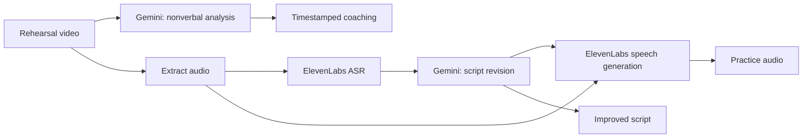

<div align="center">

# 🏆 HackCMU 2026 Winner

### Rehearse — Your next presentation starts with a better rehearsal.

**HackCMU 2026 우승 프로젝트 레포지토리**

Record yourself. See what to improve. Hear your next take.


</div>

We built a presentation coach that turns one rehearsal recording into three useful
results: timestamped feedback on body language, a clearer presentation script, and
an audio reference that reads the improved script in the speaker's cloned voice.

## One recording. Three ways to improve.

| Result | What you get | Powered by |
| --- | --- | --- |
| **Nonverbal coaching** | Time ranges, observable gaze/gesture/posture problems, and actionable corrections | Gemini video understanding |
| **Script coaching** | Original transcript, concrete script issues, and a revised presentation script | ElevenLabs Scribe + Gemini |
| **Hear the improvement** | The revised script spoken with a cloned reference voice | ElevenLabs IVC + TTS |



The normal flow makes **two Gemini generation requests**: one for nonverbal analysis
and one that improves the ElevenLabs transcript. ElevenLabs makes one ASR request
and one TTS request when a voice is cached; a new voice also needs one IVC creation request.
Video validation retries, when needed, add Gemini requests and are logged separately.

## Built with

| Layer | Technology |
| --- | --- |
| Frontend | Next.js, React, Tailwind CSS |
| Backend | FastAPI, Python 3.12 |
| Video and script analysis | Google Cloud Gemini 3.8 Flash |
| Transcription, voice, and speech | ElevenLabs Scribe v2, Instant Voice Cloning, Multilingual v2 |
| Media processing | FFmpeg |

## Run locally

From the repository root:

```bash
python3.12 -m venv backend/.venv
source backend/.venv/bin/activate
pip install -r backend/requirements.txt
cp backend/.env.example backend/.env
gcloud auth application-default login
uvicorn backend.main:app --reload
```

Set `GOOGLE_CLOUD_PROJECT` and `ELEVENLABS_API_KEY` in `backend/.env`.
Use an ElevenLabs plan/account with Instant Voice Cloning enabled. FFmpeg is resolved
from your PATH or the bundled `imageio-ffmpeg` dependency.

In another terminal:

```bash
cd frontend
npm install
npm run dev
```

Frontend: **http://localhost:3000** · API docs: **http://localhost:8000/docs**

Click **Start recording** to capture camera and microphone together, then **Stop & analyze**.
The browser uploads the recording and follows progress until the original video, delivery
notes, original/revised script tabs, and generated audio are ready. Existing recordings
can also be uploaded. Camera capture requires localhost or HTTPS. Recordings stop
automatically at 90 seconds. The last run restores on reload; `/?run=<run_id>` opens a saved run.

## Try the pipeline

```bash
curl -X POST http://localhost:8000/api/pipeline \
  -F 'file=@/path/to/your-recording.mov' \
  -F 'user_id=demo-user'
```

The response contains a run ID and URLs for the feedback JSON, revised script, and
generated MP3. The upload returns **202 Accepted** with a run ID; poll
`GET /api/runs/{run_id}` for progress, partial results, and final output URLs.
Individual stages can also be called independently. See the [backend guide](backend/README.md).

## Repository map

```text
backend/
  gemini_video/       Nonverbal analysis, validation, retries, attempt logs
  gemini_script/      Text-based script feedback and revision
  elevenlabs_asr/     Original speech transcription with Scribe v2
  elevenlabs_tts/     Audio extraction, voice cache, cloned-voice TTS
  pipeline/          Orchestrates the three stages
  common/            Configuration, media utilities, artifact logging
  tests/             API, retry, validation, cache, and pipeline checks
  experiments/       Earlier Gemini TTS and voice-replication experiments
  artifacts/         Local recordings/results; excluded from Git
frontend/            Next.js frontend
docs/                Development notes
```

Each run has its own `inputs/`, `intermediates/`, `outputs/`, and `logs/` directories.
Recordings, credentials, generated audio, and local voice caches stay out of Git.

## Verify

```bash
backend/.venv/bin/python -m unittest discover -s backend/tests -t .
```

Browser checks: `cd frontend && npm run test:e2e` (run `npx playwright install chromium --only-shell` once).
The tests simulate recording without accessing a real camera and mock paid provider requests.
Set `REAL_RUN_ID` to also inspect an already-generated result without new generation calls.

Generated coaching and speech remain model
outputs to review and rehearse with; they are not guarantees of perfect delivery.
