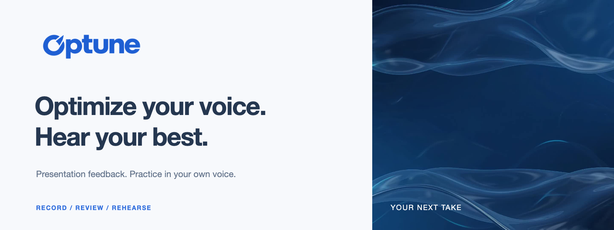
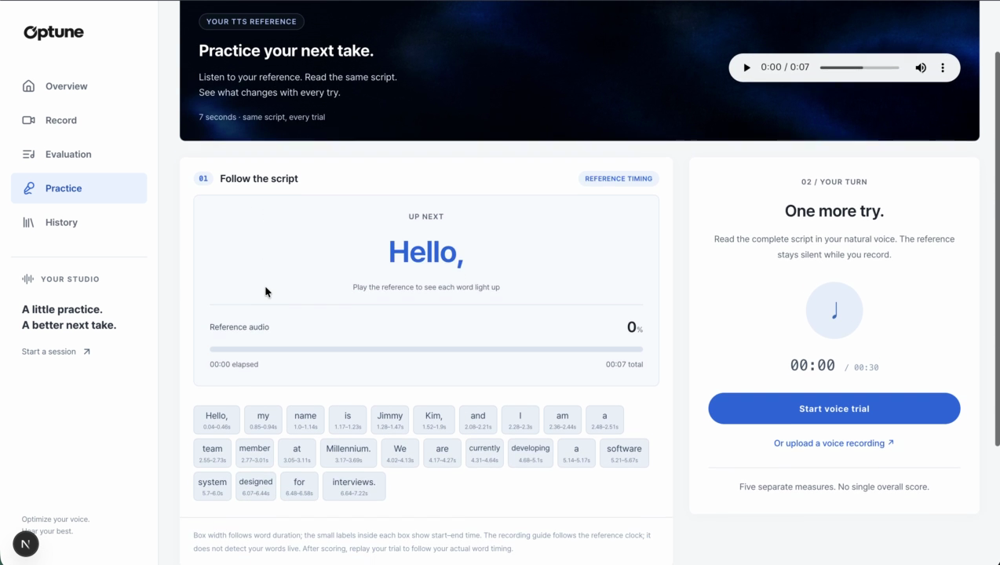
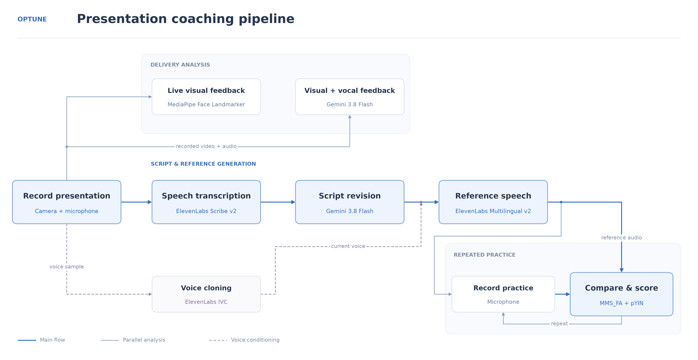

<p align="center">
  
</p>

<p align="center">
  <strong>Your presentation. A clearer script. A better next take.</strong><br>
  Built for HackCMU 2026.
</p>

Optune helps users **optimize their public speaking** with feedback on delivery,
voice, and script. Record a presentation, hear an improved version in your own voice,
and practice it with word-level guidance and speech scoring.

## Demo

[](https://github.com/ccho4702/hackCMU/raw/refs/heads/main/assets/demo.mp4)

[Watch / download the full demo](https://github.com/ccho4702/hackCMU/raw/refs/heads/main/assets/demo.mp4) · 1:56

## Record. Refine. Rehearse.

| | What you get |
| --- | --- |
| **See your delivery** | Live face mesh and gaze cues, followed by separate timestamped nonverbal and vocal feedback. |
| **Shape your message** | Original and improved scripts side by side, with concrete issues and six scenario options. |
| **Hear your next take** | The revised script in your cloned voice, with word-level timing. |
| **Practice with purpose** | Timed word cues, repeat recordings, and pronunciation, pace, rhythm, intonation, and stress comparisons. |

**Scenarios:** Presentation · Interview · Formal · Casual conversation · With a friend · Pitch

**Languages:** English and Korean feedback/TTS · English practice scoring

## Under the hood



| Component | Technology |
| --- | --- |
| Studio & API | Next.js · React · FastAPI |
| Live visual cues | MediaPipe Face Landmarker |
| Delivery feedback & script revision | Gemini 3.8 Flash |
| Transcription & personal reference voice | ElevenLabs Scribe v2 · IVC · Multilingual v2 |
| Practice scoring | MMS_FA · librosa pYIN |
| Media & history | FFmpeg · MongoDB |

One recording normally uses **2 Gemini calls + 1 ASR call + 1 TTS call**.
Voice cloning is added on a cache miss; retries add requests. Repeated trial scoring
runs locally against the same reference. Results, recordings, and logs are organized per run.

## Try it locally

Python 3.12 · Node.js 22+ · Google Cloud and ElevenLabs credentials · MongoDB for profiles/history.
Follow the [setup guide](docs/setup.md), then run these in two terminals from the repository root:

```bash
# Backend
backend/.venv/bin/uvicorn backend.main:app --host 127.0.0.1 --port 8000
```

```bash
# Frontend
npm --prefix frontend run dev -- --hostname 127.0.0.1 --port 3000
```

Open **http://127.0.0.1:3000** → record or upload → review → practice.

[Backend guide](backend/README.md) · [Frontend guide](frontend/README.md) ·
[Speech scoring](backend/scoring/README.md) · [Facial scoring](docs/facial-delivery-scores.md) ·
[MediaPipe details](docs/mediapipe-main.md)
